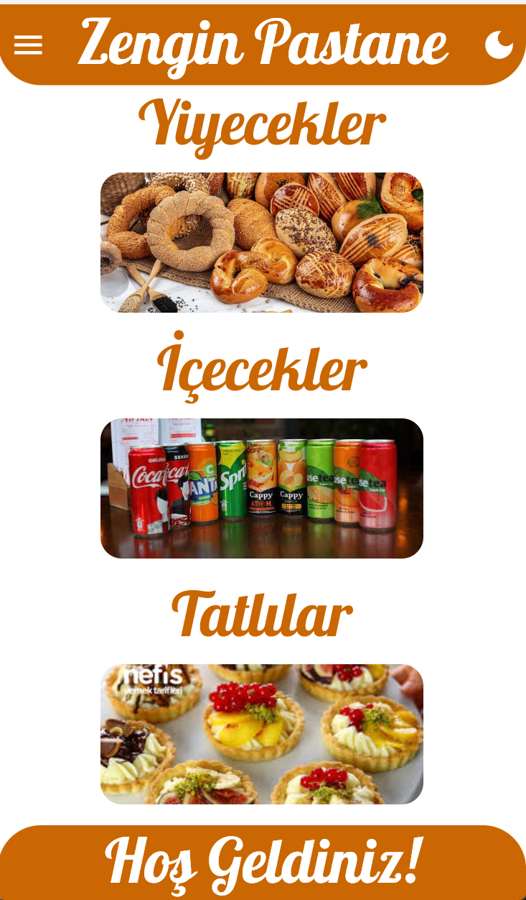
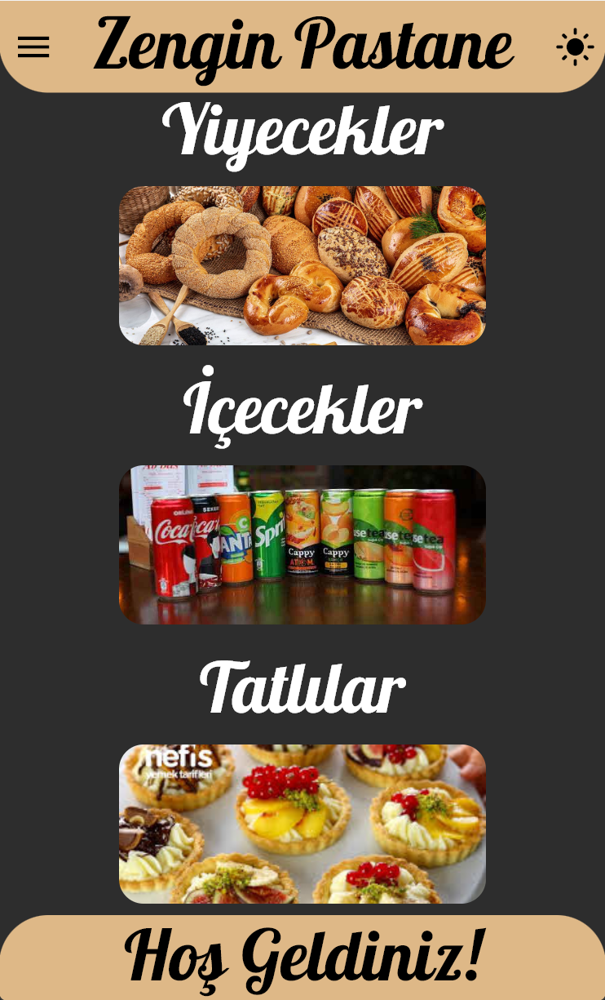
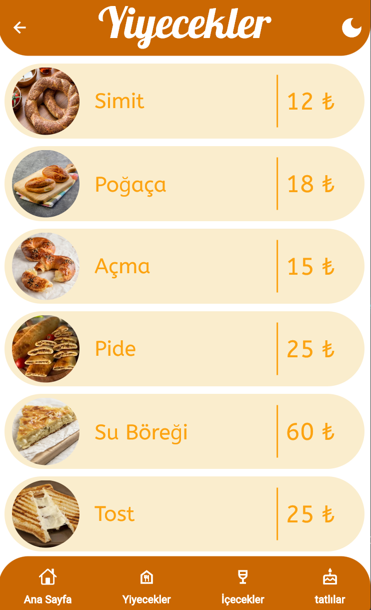
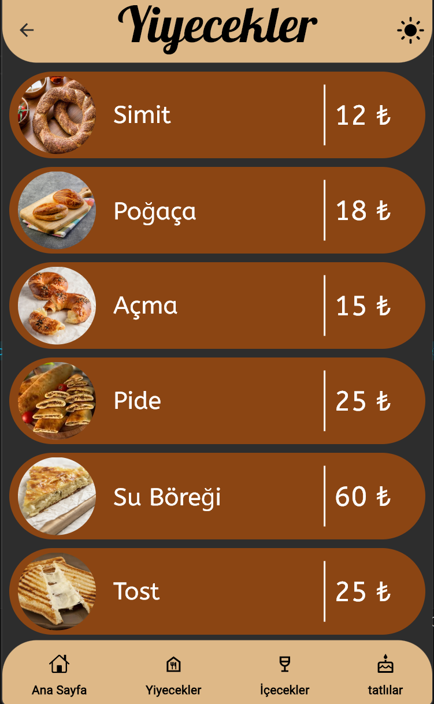
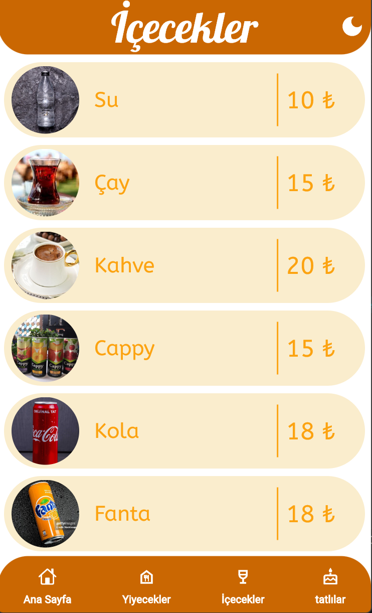
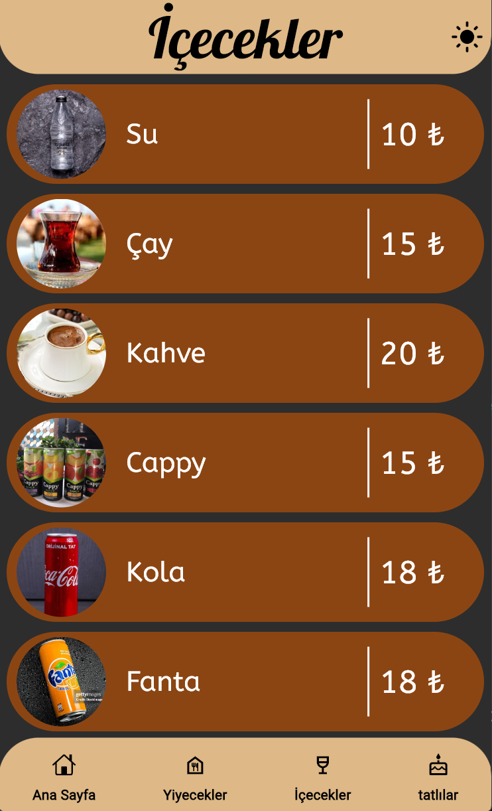
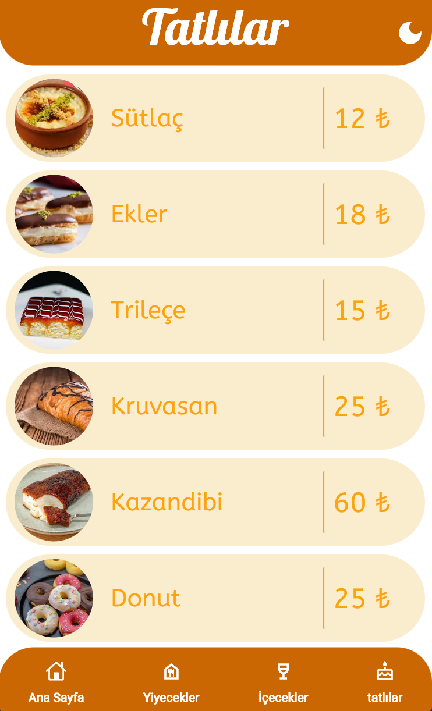
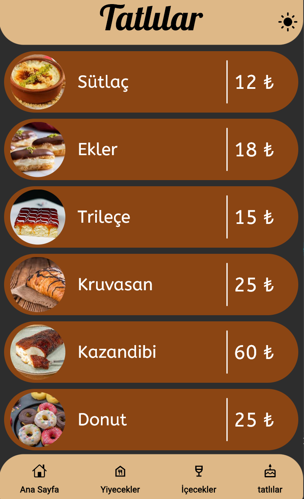
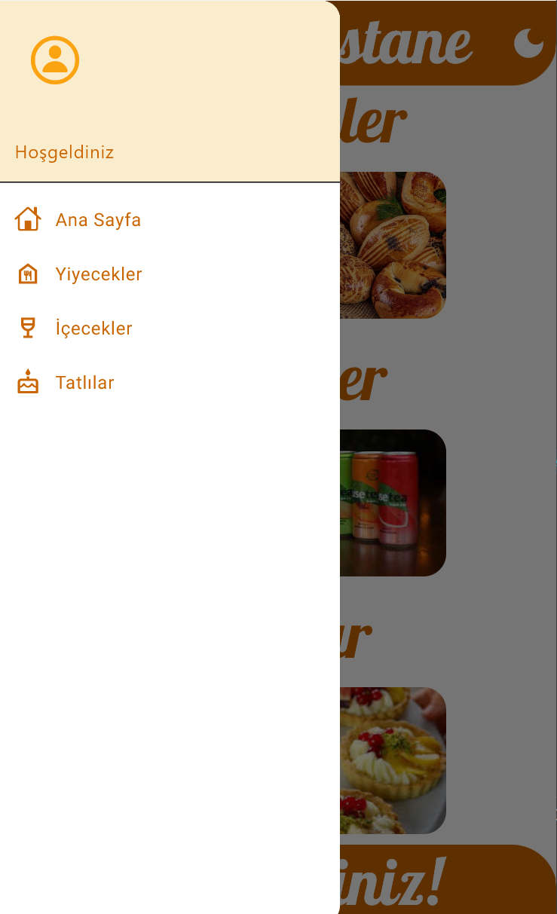

# **Bakery_Menu**


## Proje Hakkında

- Modern ve kullanıcı dostu pastane menü uygulaması

### **Danışman:**

[[https://github.com/keyvanarasteh](https://github.com/keyvanarasteh)] (Keyvan Arasteh)

### **Takım Üyesi:**

-   Ali Rıza Zengin [GitHub](https://github.com/aliriza1926)

----------

### **🎥 Demo Video**

<div align="center">
  
<div align="center">
  <video src="demo/Demo.mp4" width="300" >
</div>
  
</div>

### **Özellikler:**

- 📱 Kullanıcı dostu arayüz
- 🌓 Açık/Koyu tema desteği
- 🍽️ Kategorilere ayrılmış menü sistemi:
  - Yiyecekler
  - İçecekler
  - Tatlılar
- ⚡ Hızlı yükleme animasyonu
- 📱 Responsive tasarım

----------

### **Kullanılan Teknolojiler:**

- **Flutter:** v3.16.9
- **Dart:** v3.2.6
- **Paketler:**
  - provider: ^6.1.1
  - lottie: ^3.0.0
  - google_fonts: ^6.1.0


----------

### **Başlangıç:**

#### **Gereksinimler:**

- Flutter SDK (sürüm 3.5.4)

- Dart SDK (sürüm 3)

----------

### **Kurulum Adımları:**

1.  Projeyi bilgisayarınıza indirin:
    
    ```bash
    git clone https://github.com/aliriza1926/Bakery_Menu  
    
    ```
    
2.  Proje klasörüne gidin:
    
    ```bash
    cd Bakery_Menu  
    
    ```
    
3.  Gerekli paketleri yükleyin:
    
    ```bash
    flutter pub get  
    
    ```
    
4.  Uygulamayı başlatın:
    
    ```bash
    flutter run  
    
    ```
    

----------

### **Proje Yapısı:**

```
lib/
├── app/
│   ├── routers.dart
│   └── themes.dart
├── screens/
│   ├── drinks_screen.dart
│   ├── foods_screen.dart
│   ├── home_screen.dart 
│   └── loading_screen.dart
├── views/
│   └── app_view.dart
└── main.dart


```

----------


### **Ekran Görüntüleri:**

<div align="center">

| Ana Sayfa - Açık Tema | Ana Sayfa - Koyu Tema |
|:-:|:-:|
|  |  |

| Yiyecekler - Açık Tema | Yiyecekler - Koyu Tema |
|:-:|:-:|
|  |  |

| İçecekler - Açık Tema | İçecekler - Koyu Tema |
|:-:|:-:|
|  |  |

| Tatlılar - Açık Tema | Tatlılar - Koyu Tema |
|:-:|:-:|
|  |  |

| Loading Screen | Drawer Menü |
|:-:|:-:|
|  |  |

</div>

----------

----------


----------

### **İletişim:**

-   **Proje Bağlantısı:** [https://github.com/aliriza1926/Bakery_Menu](https://github.com/aliriza1926/Bakery_Menu)
-   **İstinye Üniversitesi:** [https://www.istinye.edu.tr/](https://www.istinye.edu.tr/)

----------

### **Teşekkürler:**

İstinye Üniversitesi'ne destekleri için teşekkür ederim.  
Danışman hocamız Keyvan Arasteh'e yardım ve destekleri için teşekkür ederim.

----------

